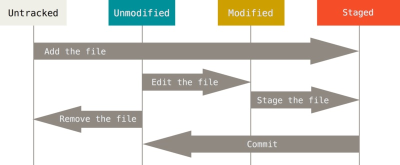
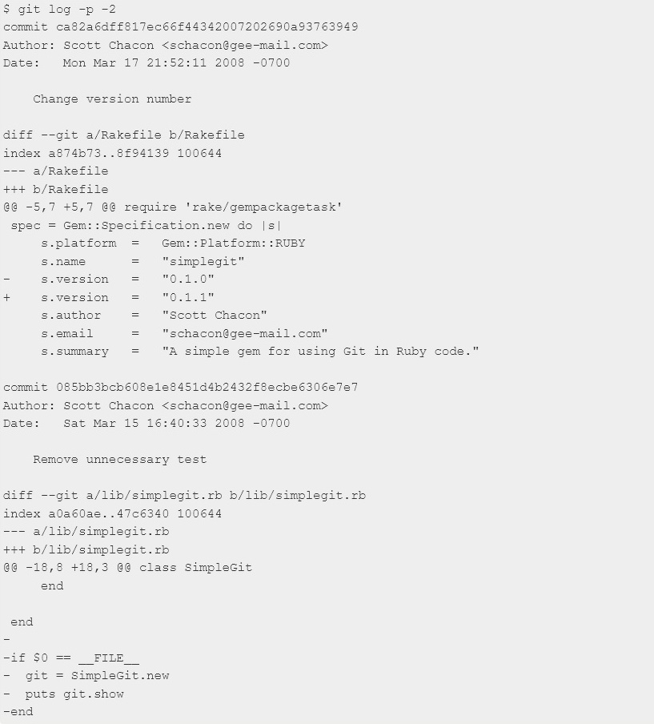
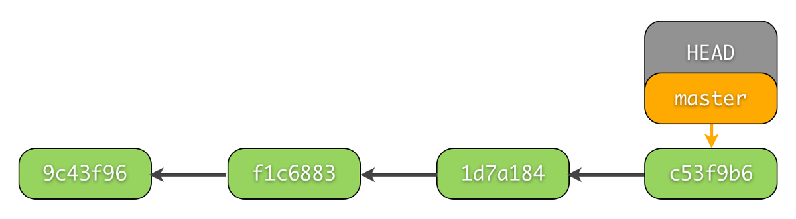

Работа с Git
=============
___


# 1. Проверка установленного Git.
### В терминале выполнить команду `git version`   
### Если Git установлен, появится сообщение с информаией о версии.   
### Иначе будет сообщение об ошибке
___
___
# 2. Установка Git
### Загружаем последнюю версию Git с сайта: 
## https://git-scm.com/downloads   
### Устанавливаем с настройками по умолчанию.
___
___
# 3. Настройка Git
### При первом использовании Git необходимо представиться.    
### Для этого нужно ввести в терминале 2 команды:

1.  `git config --global user.name "name"`    
2.  `git config --global user.email "mail@example.com"`
___
___
 # 4. Инициализация репозитория
 ### Получить репозиторий можно двумя способами:
 1. В терминале переходим к папке, в которой хотим создать репозиторий. Выполняем компнду `git init`.    
 В исходной папке появится скрытая папка *.git, содержащая все необходимые файлы репозитория - структуру Git репозитория.
 2. Клонируем существующий репозиторий Git из любого места.
 Выполняем команду `git clone <url>`.  
 Если вы хотите клонировать библиотеку libgit2, вы можете сделать это следующим образом:  
 `git clone https://github.com/libgit2/libgit2`   
 Эта команда создаёт каталог libgit2,  
 инициализирует в нём подкаталог *.git, скачивает все данные для этого репозитория и извлекает рабочую копию последней версии.    
 Если вы перейдёте в только что созданный каталог libgit2,   то увидите в нём файлы проекта, готовые для работы или использования. Для того, чтобы клонировать репозиторий в каталог с именем, отличающимся от libgit2, необходимо указать желаемое имя, как параметр командной строки:  
 `git clone https://github.com/libgit2/libgit2 mylibgit`   
 Эта команда делает всё то же самое, что и предыдущая, только результирующий каталог будет назван mylibgit.

___
___

# 5. Запись изменений в репозиторий
### Каждый файл в вашем рабочем каталоге может находиться в одном из двух состояний: под версионным контролем _(отслеживаемые)_ и нет _(неотслеживаемые)_. _Отслеживаемые_ файлы — это те файлы, которые были в последнем снимке состояния проекта; они могут быть неизменёнными, изменёнными или подготовленными к коммиту. Если кратко, то _отслеживаемые_ файлы — это те файлы, о которых знает Git.

### _Неотслеживаемые файлы_ — это всё остальное, любые файлы в вашем рабочем каталоге, которые не входили в ваш последний снимок состояния и не подготовлены к коммиту. Когда вы впервые клонируете репозиторий, все файлы будут _отслеживаемыми_ и неизменёнными, потому что Git только что их извлек и вы ничего пока не редактировали.

### Как только вы отредактируете файлы, Git будет рассматривать их как _изменённые_, так как вы изменили их с момента последнего коммита. Вы индексируете эти изменения, затем фиксируете все проиндексированные изменения, а затем цикл повторяется.




- ### Основной инструмент, используемый для определения, какие файлы в каком состоянии находятся —  `git status`
- ### Для того чтобы начать отслеживать (добавить под версионный контроль) новый файл - `git add`  
- ### Для фиксации изменений и присвоения назвиния новым версиям - `git commit -m "имя"`
- ### Коммит с одновременным добавлением всего в индекс - 
   `git commit -a -m "имя"`
- ### Нередко разные изменения делаются в одних и тех же файлах. То есть изменения в этих файлах по-хорошему должны находиться в разных коммитах. И даже такое можно сделать с помощью Git. Для этого подходит команда `git add -i`, которая показывает измененные куски файлов и спрашивает, что с ними сделать. С помощью этой команды можно очень точно выбрать то, что должно попасть в коммит, а что нет. Ее использование обычно показывает хороший уровень владения Git.
___
___
# 6. Просмотр истории *коммитов*
+ ### Одним из основных и наиболее мощных инструментов для этого является команда `git log`.
+ ### Для более краткого вывода истории *коммитов* (в одну строку) используйте команду `git log --oneline`   
```
Одним из самых полезных аргументов является `-p` или `--patch`, который показывает разницу (выводит патч), внесенную в каждый коммит. Так же вы можете ограничить количество записей в выводе команды; 
```
### используйте параметр [-2] для вывода только двух записей:




### если вы хотите увидеть сокращенную статистику для каждого коммита, вы можете использовать опцию `--stat`

___
___

# 7. Сравнение коммитов 

* ###  `git diff` 
Команда выводит изменения в файлах, которые еще не были добавлены в индекс. Сравнение происходит с последним коммитом.
* ### `git diff --cached` 
Если вы изменили какие-нибудь файлы в вашем рабочем каталоге и добавили один или несколько из них в индекс (с помощью `git add`), то команда `git diff` не покажет изменения в этих файлах. Чтобы показать изменения в файлах, включая файлы, добавленные в индекс, используется ключ `--cached`

* ### `git diff 406750f 544cac4`
Сравним два коммита. Для этого в качестве первого аргумента команде `git diff` указывается _хеш первого коммита_, а вторым аргументом _хеш второго коммита_.

* ### `git diff -h` 
Справка по сопутствующим командам `git diff`.
___
___
# 8. Переключение между коммитами
* `git checkout "commit_name"`     
переключение на нужный коммит
* `git switch-` / `git checkout master`     
переход в актуальную версию


___
___

# 9. Ветвление в Git
## Когда вы создаёте коммит командой `git commit`, Git вычисляет контрольные суммы каждого подкаталога (в нашем случае, только основной каталог проекта) и сохраняет его в репозитории как объект дерева каталогов. Затем Git создаёт объект коммита с метаданными и указателем на основное дерево проекта для возможности воссоздать этот снимок в случае необходимости.
## Ваш репозиторий Git теперь хранит пять объектов: три блоб объекта (по одному на каждый файл), объект дерева каталогов, содержащий список файлов и соответствующих им блобов, а так же объект коммита, содержащий метаданные и указатель на объект дерева каталогов.

## Если вы сделаете изменения и создадите ещё один коммит, то он будет содержать указатель на предыдущий коммит.


```
Ветка «master» в Git — это не какая-то особенная ветка. Она точно такая же, как и все остальные ветки. Она существует почти во всех репозиториях только лишь потому, что её создаёт команда git init, а большинство людей не меняют её название.
```


# 9.1. Создание новой ветки и перемещение
## `git branch "branch_name"` - создаёт новую ветку для с присвоением имени.
#### Эта команда только создает новую ветку, но не переключается на нее.
## `git checkout "branch_name"` - перемещение на заданную веткую.
## `git checkout -b "branch_name"` - создает новую ветку и перемещается на нее
## `git branch -d "branch_name"` - удаление ветки, при наличии не слитой в master информации - потребует подтверждение. 

# 9.2. Слияние и возможные конфликты
## Для слияния необходимо переключиться на ветку, в которую вы хотите включить изменения, и выполнить команду `git merge "branch_name"`

## Теперь, когда изменения слиты, ветка `branch_name` больше не нужна. Вы можете закрыть задачу в системе отслеживания ошибок и удалить ветку.
## Иногда процесс не проходит гладко. Если вы изменили одну и ту же часть одного и того же файла по-разному в двух объединяемых ветках, Git не сможет их чисто объединить.
## Чтобы в любой момент после появления конфликта увидеть, какие файлы не объединены, вы можете запустить `git status`.
## В конфликтующие файлы Git добавляет специальные маркеры конфликтов, чтобы вы могли исправить их вручную. Чтобы разрешить конфликт, придётся выбрать один из вариантов, либо объединить содержимое по-своему. Разрешив каждый конфликт во всех файлах, запустите git add для каждого файла, чтобы отметить конфликт как решённый. Добавление файла в индекс означает для Git, что все конфликты в нём исправлены.
## Если вы хотите использовать графический инструмент для разрешения конфликтов, можно запустить `git mergetool`, который проведет вас по всем конфликтам.
## Если результат вас устраивает и вы убедились, что все файлы, где были конфликты, добавлены в индекс — выполните команду `git commit` для создания коммита слияния. 