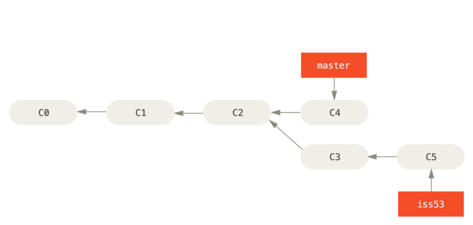

Работа с **Git**
=============
___


# 1. Проверка установленного **Git**.
### В терминале выполнить команду `git version`   
### Если **Git** установлен, появится сообщение с информаией о версии.   
### Иначе будет сообщение об ошибке
___
___
# 2. Установка **Git**
### Загружаем последнюю версию **Git** с [сайта](https://git-scm.com/downloads)   
### Устанавливаем с настройками по умолчанию.
___
___
# 3. Настройка **Git**
### При первом использовании **Git** необходимо представиться.    
### Для этого нужно ввести в терминале 2 команды:

1.  `git config --global user.name "name"`    
2.  `git config --global user.email "mail@example.com"`
___
___
 # 4. Инициализация репозитория
 ### Получить репозиторий можно двумя способами:
 1. В терминале переходим к папке, в которой хотим создать репозиторий. Выполняем компнду `git init`.    
 В исходной папке появится скрытая папка ***.git**, содержащая все необходимые файлы репозитория - структуру **Git** репозитория.
 2. Клонируем существующий репозиторий **Git** из любого места.
 Выполняем команду `git clone <url>`.  
 Если вы хотите клонировать библиотеку **libgit2**, вы можете сделать это следующим образом:  
 `git clone https://github.com/libgit2/libgit2`   
 Эта команда создаёт каталог **libgit2**,  
 инициализирует в нём подкаталог ***.git**, скачивает все данные для этого репозитория и извлекает рабочую копию последней версии.    
 Если вы перейдёте в только что созданный каталог **libgit2**,   то увидите в нём файлы проекта, готовые для работы или использования. Для того, чтобы клонировать репозиторий в каталог с именем, отличающимся от **libgit2**, необходимо указать желаемое имя, как параметр командной строки:  
 `git clone https://github.com/libgit2/libgit2 mylibgit`   
 Эта команда делает всё то же самое, что и предыдущая, только результирующий каталог будет назван **mylibgit**.

___
___

# 5. Запись изменений в репозиторий
### Каждый файл в вашем рабочем каталоге может находиться в одном из двух состояний: под версионным контролем **_(отслеживаемые)_** и нет **_(неотслеживаемые)_**. **_Отслеживаемые_** файлы — это те файлы, которые были в последнем снимке состояния проекта; они могут быть неизменёнными, изменёнными или подготовленными к коммиту. Если кратко, то **_отслеживаемые_** файлы — это те файлы, о которых знает **Git**.

### **_Неотслеживаемые файлы_** — это всё остальное, любые файлы в вашем рабочем каталоге, которые не входили в ваш последний снимок состояния и не подготовлены к коммиту. Когда вы впервые клонируете репозиторий, все файлы будут **_отслеживаемыми_** и неизменёнными, потому что **Git** только что их извлек и вы ничего пока не редактировали.

### Как только вы отредактируете файлы, **Git** будет рассматривать их как **_изменённые_**, так как вы изменили их с момента последнего коммита. Вы индексируете эти изменения, затем фиксируете все проиндексированные изменения, а затем цикл повторяется.


- ### Основной инструмент, используемый для определения, какие файлы в каком состоянии находятся —  `git status`
- ### Для того чтобы начать отслеживать (добавить под версионный контроль) новый файл - `git add`  
- ### Для фиксации изменений и присвоения назвиния новым версиям - `git commit -m "имя"`
- ### Коммит с одновременным добавлением всего в индекс - 
   `git commit -a -m "имя"`
- ### Нередко разные изменения делаются в одних и тех же файлах. То есть изменения в этих файлах по-хорошему должны находиться в разных коммитах. И даже такое можно сделать с помощью Git. Для этого подходит команда `git add -i`, которая показывает измененные куски файлов и спрашивает, что с ними сделать. С помощью этой команды можно очень точно выбрать то, что должно попасть в коммит, а что нет. Ее использование обычно показывает хороший уровень владения **Git**.
___
___
# 6. Просмотр истории коммитов
+ ### Одним из основных и наиболее мощных инструментов для этого является команда `git log`.
+ ### Для более краткого вывода истории коммитов (в одну строку) используйте команду `git log --oneline`   
```
Одним из самых полезных аргументов является `-p` или `--patch`, который показывает разницу (выводит патч), внесенную в каждый коммит. Так же вы можете ограничить количество записей в выводе команды; 
```
### используйте параметр [-2] для вывода только двух записей:


### если вы хотите увидеть сокращенную статистику для каждого коммита, вы можете использовать опцию `--stat`

___
___

# 7. Сравнение коммитов 

* ###  `git diff` 
Команда выводит изменения в файлах, которые еще не были добавлены в индекс. Сравнение происходит с последним коммитом.
* ### `git diff --cached` 
Если вы изменили какие-нибудь файлы в вашем рабочем каталоге и добавили один или несколько из них в индекс (с помощью `git add`), то команда `git diff` не покажет изменения в этих файлах. Чтобы показать изменения в файлах, включая файлы, добавленные в индекс, используется ключ `--cached`

* ### `git diff 406750f 544cac4`
Сравним два коммита. Для этого в качестве первого аргумента команде `git diff` указывается _хеш первого коммита_, а вторым аргументом _хеш второго коммита_.

* ### `git diff -h` 
Справка по сопутствующим командам `git diff`.
___
___
# 8. Переключение между коммитами
* `git checkout "commit_name"`     
переключение на нужный коммит
* `git switch-` / `git checkout master`     
переход в актуальную версию


___
___

# 9. Ветвление в **Git**
## Когда вы создаёте коммит командой `git commit`, **Git** вычисляет контрольные суммы каждого подкаталога (в нашем случае, только основной каталог проекта) и сохраняет его в репозитории как объект дерева каталогов. Затем **Git** создаёт объект коммита с метаданными и указателем на основное дерево проекта для возможности воссоздать этот снимок в случае необходимости.
## Ваш репозиторий **Git** теперь хранит пять объектов: три блоб объекта (по одному на каждый файл), объект дерева каталогов, содержащий список файлов и соответствующих им блобов, а так же объект коммита, содержащий метаданные и указатель на объект дерева каталогов.

## Если вы сделаете изменения и создадите ещё один коммит, то он будет содержать указатель на предыдущий коммит.


```
Ветка «master» в Git — это не какая-то особенная ветка. Она точно такая же, как и все остальные ветки. Она существует почти во всех репозиториях только лишь потому, что её создаёт команда git init, а большинство людей не меняют её название.
```


# 9.1. Создание новой ветки и перемещение
## `git branch "branch_name"` - создаёт новую ветку для с присвоением имени.
#### Эта команда только создает новую ветку, но не переключается на нее.
## `git checkout "branch_name"` - перемещение на заданную веткую.
## `git checkout -b "branch_name"` - создает новую ветку и перемещается на нее
## `git branch -d "branch_name"` - удаление ветки, при наличии не слитой в master информации - потребует подтверждение. 

# 9.2. Слияние и возможные конфликты
## Для слияния необходимо переключиться на ветку, в которую вы хотите включить изменения, и выполнить команду `git merge "branch_name"`

## Теперь, когда изменения слиты, ветка `branch_name` больше не нужна. Вы можете закрыть задачу в системе отслеживания ошибок и удалить ветку.
## Иногда процесс не проходит гладко. Если вы изменили одну и ту же часть одного и того же файла по-разному в двух объединяемых ветках, Git не сможет их чисто объединить.
## Чтобы в любой момент после появления конфликта увидеть, какие файлы не объединены, вы можете запустить `git status`.
## В конфликтующие файлы Git добавляет специальные маркеры конфликтов, чтобы вы могли исправить их вручную. Чтобы разрешить конфликт, придётся выбрать один из вариантов, либо объединить содержимое по-своему. Разрешив каждый конфликт во всех файлах, запустите git add для каждого файла, чтобы отметить конфликт как решённый. Добавление файла в индекс означает для Git, что все конфликты в нём исправлены.
## Если вы хотите использовать графический инструмент для разрешения конфликтов, можно запустить `git mergetool`, который проведет вас по всем конфликтам.
## Если результат вас устраивает и вы убедились, что все файлы, где были конфликты, добавлены в индекс — выполните команду `git commit` для создания коммита слияния. 
___
___
## 10. Игнорирование файлов
### Вы можете заставить Git игнорировать определенные файлы и каталоги, то есть исключить их от отслеживания Git - путем создания одного или нескольких файлов `.gitignore` в вашем репозитории.
### Записи в файле `.gitignore` могут включать имена или пути, указывающие на:
- ### временные ресурсы, например, кэши, файлы журналов, скомпилированный код и т. д.
- ### файлы локальной конфигурации, которые не должны использоваться совместно с другими разработчиками
- ### файлы, содержащие секретную информацию, такие как пароли входа, ключи и учетные данные
### Для этого необходимо вписать в файл `.gitignore` имя файла, адрес или расширение.
```
При создании в каталоге верхнего уровня правила будут применяться рекурсивно ко всем файлам и подкаталогам во всем репозитории. При создании в подкаталоге правила будут применяться к этому конкретному каталогу и его подкаталогам.
```
### Когда файл или каталог игнорируются, это не будет:
- ### отслеживать **Git**
- ### сообщать командами, такими как `git status` или `git diff`
- ### работать с такими командами, как `git add -A`
## Примеры
Вот некоторые общие примеры правил в файле `.gitignore` , основанные на шаблонах файлов `glob` :
```
# Lines starting with `#` are comments.

# Ignore files called 'file.ext'
file.ext

# Comments can't be on the same line as rules!
# The following line ignores files called 'file.ext # not a comment'
file.ext # not a comment 

# Ignoring files with full path.
# This matches files in the root directory and subdirectories too.
# i.e. otherfile.ext will be ignored anywhere on the tree.
dir/otherdir/file.ext
otherfile.ext

# Ignoring directories
# Both the directory itself and its contents will be ignored.
bin/
gen/

# Glob pattern can also be used here to ignore paths with certain characters.
# For example, the below rule will match both build/ and Build/
[bB]uild/

# Without the trailing slash, the rule will match a file and/or
# a directory, so the following would ignore both a file named `gen`
# and a directory named `gen`, as well as any contents of that directory
bin
gen

# Ignoring files by extension
# All files with these extensions will be ignored in
# this directory and all its sub-directories.
*.apk
*.class

# It's possible to combine both forms to ignore files with certain
# extensions in certain directories. The following rules would be
# redundant with generic rules defined above.
java/*.apk
gen/*.class

# To ignore files only at the top level directory, but not in its
# subdirectories, prefix the rule with a `/`
/*.apk
/*.class

# To ignore any directories named DirectoryA 
# in any depth use ** before DirectoryA
# Do not forget the last /, 
# Otherwise it will ignore all files named DirectoryA, rather than directories
**/DirectoryA/
# This would ignore 
# DirectoryA/
# DirectoryB/DirectoryA/ 
# DirectoryC/DirectoryB/DirectoryA/
# It would not ignore a file named DirectoryA, at any level

# To ignore any directory named DirectoryB within a 
# directory named DirectoryA with any number of 
# directories in between, use ** between the directories
DirectoryA/**/DirectoryB/
# This would ignore 
# DirectoryA/DirectoryB/ 
# DirectoryA/DirectoryQ/DirectoryB/ 
# DirectoryA/DirectoryQ/DirectoryW/DirectoryB/

# To ignore a set of files, wildcards can be used, as can be seen above.
# A sole '*' will ignore everything in your folder, including your .gitignore file.
# To exclude specific files when using wildcards, negate them.
# So they are excluded from the ignore list:
!.gitignore 

# Use the backslash as escape character to ignore files with a hash (#)
# (supported since 1.6.2.1)
\#*#
```
Большинство файлов `.gitignore` являются стандартными для разных языков, поэтому для начала работы здесь приведены образцы файлов `.gitignore` перечисленных на языке, из которого можно клонировать или копировать, вносить изменения в ваш проект. Кроме того, для нового проекта вы можете автоматически генерировать стартовый файл с помощью [онлайн-инструмента](https://www.toptal.com/developers/gitignore "гитигнор").
___
___

# 11. GitHub
## 11.1. Настройка и конфигурация учетной записи
### Первым делом необходимо [создать учетную запись](https://github.com)
```
GitHub предоставляет почти все свои функции для бесплатных учётных записей, за исключением некоторых расширенных возможностей. Платные тарифы GitHub включают расширенные инструменты и функции, а также увеличенные лимиты на бесплатные услуги.
```
## Доступ по SSH
### На данный момент вы можете подключаться к репозиториям Git используя протокол **https://** авторизуясь при помощи только что созданного логина и пароля. Однако для того чтобы просто клонировать публично доступный проект, вам необязательно авторизовываться на сайте, но тем не менее, только что созданный аккаунт понадобится в то время, когда вы захотите загрузить (push) сделанные вами изменения.

### Если же вы хотите использовать **SSH** доступ, в таком случае вам понадобится добавить публичный **SSH** ключ. (Если же у вас нет публичного SSH ключа, вы можете его [сгенерировать](https://docs.github.com/en/github/authenticating-to-github/generating-a-new-ssh-key-and-adding-it-to-the-ssh-agent))
## Ваши почтовые адреса
### **GitHub** использует ваш почтовый адрес для привязки ваших **Git** коммитов к вашей учётной записи. Если вы используете несколько почтовых адресов в своих коммитах и хотите, чтобы GitHub работал с ними корректно, то вам нужно будет добавить все используемые почтовые адреса в секцию под названием «Почтовые адреса» («Emails»), расположенную на вкладке «Администрирование» («Admin»).
